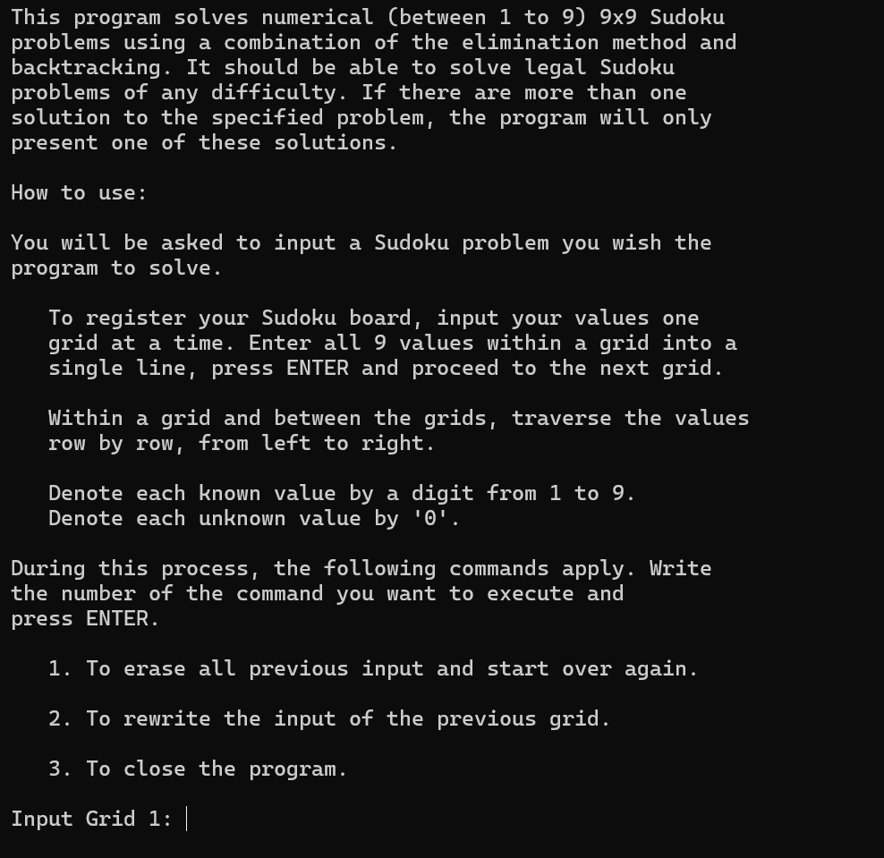
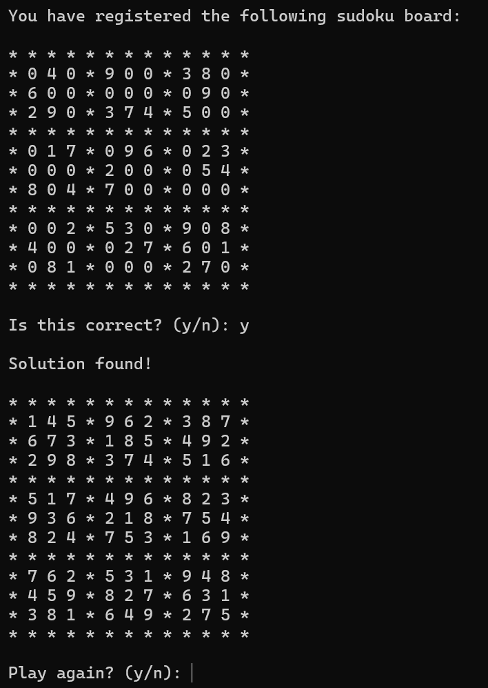

# Sudoku Solver
A C program that solves 9x9 Sudoku problems.  
  
This program reads a numerical (between 1 to 9) 9x9 Sudoku board, 
validates it, attempts to solve it, prints either a solution or an
unsolved notice, and repeats this process until the user decides
to terminate the program. User interface takes place through the
terminal. The program attempts to solve the specified Sudoku
problems using a combination of the elimination method and
backtracking. Therefore, it should be able to solve legal Sudoku
problems of any difficulty. If there are more than one solution to
the specified problem, the program will only present one of these
solutions.

## How To Use (on Windows)
**1. Compile the code**  
gcc -Wall -std=c99 -o sudoku sudoku_solver.c sudoku_cell.c sudoku_solver_utils.c linked_list.c

**2. Run the program**  
sudoku  
  
**3. Follow the instruction written on the terminal**

## Screenshots
  
  
  

## Future Improvements
- Additional Constraints
